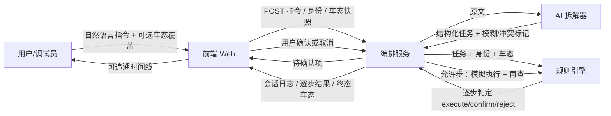

# 01 · Flow-map（全景）· 题 05

> **交付链第 1 棒** · 上游：`docs/题05-要求与得分点梳理.md` · 下游读者：PRD（第 2 棒）  
> 版本：v0.1 · 2026-07-16  
> 目标：谁交什么给谁；标断点与 AI 参与点；人工最终准出权写清。

**Delivery progress**

```text
Delivery progress:
- [x] 1 Flow-map（本文件）
- [x] 2 PRD → DOCS/diagnosis/02_product-prd.md
- [ ] 3 Design
- [ ] 4 Tasks / dev-workflow
- [ ] 5 Implement
- [ ] 6 Tests
- [ ] 7 Gates / reflection
```

---

## 1. 一句话主线

驾驶员（或调试员）用自然语言下发车控意图 → **AI 只负责拆解建议** → **规则引擎做权限/安全/车态判断** → 风险步须 **人确认** → 模拟执行并落日志 → 前端全程可追溯展示。

核心冲突：`意图可理解` ≠ `允许执行`。

---

## 2. 角色与职责（接力表）

| 角色 | 人/系统 | 负责什么 | 不负责什么（防越界） |
| --- | --- | --- | --- |
| **用户（驾驶员）** | 人 | 输入指令；对模糊点补充；对风险操作确认/取消 | 不直接改规则引擎结论 |
| **调试员（演示用）** | 人（可与驾驶员同一前端切换） | 调车态/身份（车速、挡位、电量、故障、角色=车主/访客）以触发规则 | 不伪造已执行成功的假日志 |
| **前端（Web）** | 系统 · 前端同学 | 指令输入；展示拆解；展示执行/确认/拒绝；确认交互；结果与时间线；调试页 | 不在前端静默改权限结论；不把「全待确认」当判断 |
| **编排服务（后端）** | 系统 · 后端同学 | 接收指令；调用拆解；挂载车态/身份；跑安全规则；编排逐步执行；写审计日志 | 不把 AI 拆解结果直接当准出 |
| **AI 拆解器** | AI（可规则/LLM mock） | 自然语言 → 结构化任务列表（对象、参数、顺序、模糊点、冲突标记） | **无执行权、无最终拒绝权** |
| **规则引擎** | 系统（后端） | 对每步给出 `execute` / `confirm` / `reject`；再查车态；部分失败策略 | 不替代人的风险确认点击 |
| **人工准出（答辩/验收）** | 团队 PO / 演示人 | 判定本轮 Demo 是否证明了「权限·安全·确认·状态·部分失败」 | 不以「功能数量」当准出 |

两端约束（题面）：**服务端 + 一个前端**；业务角色 MVP 内压到 **车主 / 临时访客** 两种身份即可。

---

## 3. 端到端流转（出 → 入，无孤岛）



### 3.1 逐步接力（入 / 出）

| 步 | 从 | 出（产物） | 到 | 入（消费） |
| --- | --- | --- | --- | --- |
| 1 | 用户 | 自然语言指令；当前身份 | 前端 | 展示输入框；附带调试页车态 |
| 2 | 前端 | `{ text, role, vehicleState }` | 编排服务 | 开启一次编排会话 |
| 3 | 编排服务 | 原文 | AI 拆解器 | 拆解 |
| 4 | AI 拆解器 | `tasks[]`：对象、参数、顺序、`ambiguity[]`、`conflict[]` | 编排服务 | 不得直接执行 |
| 5 | 编排服务 | tasks + role + vehicleState | 规则引擎 | 逐步判定 |
| 6 | 规则引擎 | 每步 `decision` ∈ {execute, confirm, reject} + reason | 编排服务 | 分支：直执 / 等人 / 拦截 |
| 7a | 编排服务 | 待确认列表 + 风险说明 | 前端 → 用户 | 确认或取消 |
| 7b | 用户 | confirm / cancel | 前端 → 编排 | 继续或中止该步/整单 |
| 8 | 编排服务 | 对 execute 步做模拟执行；执行后车态 | 规则引擎（再查） | 成功 / 阻止 / 部分失败 |
| 9 | 编排服务 | 会话审计：输入、拆解、判定、确认、逐步结果、终态 | 前端 | 时间线可追溯 |
| 10 | 前端 | 演示视图（主路径 / 一正一反） | 人工准出 | 答辩验收 |

---

## 4. 题目闭环映射（演示主线）

| 题面步骤 | Flow-map 落点 | 前端必须看见 | 后端必须产出 |
| --- | --- | --- | --- |
| 1 输入指令 | 步 1–2 | 输入区 + 身份 | 会话创建 |
| 2 拆解任务 | 步 3–4 | 结构化任务卡（含模糊点） | `tasks[]` |
| 3 安全检查 | 步 5–6 | 每步决策色标：执行/确认/拒绝 | `decision` + reason |
| 4 补充/确认 | 步 7 | 确认弹层；补充模糊参数 | 等待态；写入确认记录 |
| 5 执行/再查 | 步 8 | 逐步成功/阻止/部分失败 | 模拟执行 + 再查 |
| 6 最终记录 | 步 9–10 | 时间线 + 终态车态 | 审计日志 |

题面线索（必须能跑通）：

| 线索 | 预期判断 | 谁说了算 |
| --- | --- | --- |
| 「主驾留条缝」参数模糊 | 不得假装精确开度直接 `execute` → `confirm` 或要求补充 | 规则引擎标模糊；**人**补参数或确认 |
| 临时访客意图合法但无授权 | `reject`，意图展示正确 | **规则引擎**；前端只展示拒绝原因 |

---

## 5. 断点（至少 1 条可修复；标注 ⚠ → √）

| ID | 断点现象 | 风险 | 修复约定（√） | 失败退回谁 |
| --- | --- | --- | --- | --- |
| **B1** | AI 拆解把模糊开度写成精确值（如 50%）且后端直接执行 | 演示变成「假精确」；违反题眼 | ⚠ 拆解若含 `ambiguity` 或参数缺失 → 规则强制 `confirm`/补参，**禁止** AI 数值直接准出 → √ | 退回 **规则引擎/后端**；前端不得本地改判为成功 |
| **B2** | 前端把所有步骤都做成「待确认」 | 等于没做判断；演示一票否决 | ⚠ 必须存在可直执与可直拒分支；调试页可构造一正一反 → √ | 退回 **产品/规则表**（PRD 第 2 棒写清） |
| **B3** | 确认后车态已变（如已行驶），仍按旧判定执行 | 状态变化未再查 | ⚠ 执行前 **再查**；不通过则 `blocked` 并记日志 → √ | 退回 **编排服务** |
| **B4** | 多步任务中一步失败，后续仍当成功 | 部分失败未处理 | ⚠ 策略：失败步记录 + 后续依赖步 `blocked`；非依赖步可继续（MVP 写死一种）→ √ | 退回 **编排策略**（PRD 勾选） |
| **B5** | 只有 Demo 视频、会话日志不可导出/不可回放 | 可追溯性红线 | ⚠ 每次会话可在前端展开完整时间线；可截图兜底进 `PROTOTYPE/` → √ | 退回 **前端原型 Owner** |

**本棒锁定的主断点：B1（AI 无最终执行权）**——后续 PRD/实现不得削弱。

---

## 6. AI 参与点（单独标注）

| 点位 | AI 做什么 | 人/规则必须保留的判断 | 记录去向 |
| --- | --- | --- | --- |
| **A1 拆解** | 自然语言 → 结构化 tasks | 是否采纳拆解；模糊是否放行 | `DOCS/ai/` + 会话日志 |
| **A2（可选）规则文案/用例建议** | 建议拒绝理由文案、边界样例 | 是否纳入正式规则表 | `DOCS/ai/` 采纳拒绝清单 |
| **A3（Day6）审查** | 反证方案漏洞、答辩追问 | 人工修正后才能进提交包 | `DOCS/ai/` + `validation/` |

**禁止：** AI 输出直接作为 `execute` 准出；禁止无人工标记的「采纳」。

---

## 7. 人工最终准出权

| 关口 | 准出人 | 准出条件（本棒约定，PRD 可细化） |
| --- | --- | --- |
| 单次会话结束 | 用户（确认/取消已完成） | 无悬挂的 `confirm` 等待项，或用户已取消会话 |
| MVP 功能准出 | 团队（前端+后端共同） | 主路径跑通 + 一正一反 + 时间线可追溯 |
| 比赛提交 / 答辩 Demo | **人工（演示人）** | 能讲清：权限、安全、确认、状态变化、部分失败；能指认 B1 如何防住 |

**原则：** 系统可自动 `reject` / 建议 `confirm`；**风险执行的最后一道闸是人**；**仓库是否可交是人**。

---

## 8. 前端 / 后端交接点（两人协作用）

| 接口意图（逻辑，非最终 API） | 前端出 | 后端入/出 |
| --- | --- | --- |
| 开始编排 | text, role, vehicleState | sessionId, tasks, stepDecisions |
| 提交确认 | sessionId, stepId, action, optionalParams | 更新后 steps + log |
| 拉取会话 | sessionId | 全量时间线 |
| 调试写车态 | vehicleState patch | 当前车态（供下次编排） |

页面（MVP 薄原型）：

1. **主控台**：输入 → 拆解视图 → 决策色标 → 确认 → 结果  
2. **调试页**：角色、车速、挡位、电量、故障  
3. **时间线抽屉/页**：可追溯

---

## 9. 本棒「出」交给谁

| 交给 | 内容 |
| --- | --- |
| **第 2 棒 PRD** | 本文件角色、闭环、B1–B5、AI 边界、准出权 → 写成 Goals/Non-goals、R↔A、输入边界勾选 |
| **DOCS/diagnosis/** | 可摘「核心冲突 / 非目标线索」起草诊断 |
| **协作** | 前端认领主控台+调试页+时间线；后端认领编排+规则+日志 |

---

## 10. 诚实边界（本棒已声明、尚未证明）

本 Flow-map **只证明协作与判断边界怎么切**，不证明：

- 真实车总线 / 量产语音 ASR
- LLM 拆解准确率
- 全量车控功能覆盖

下一棒 PRD 须把以上写入 Non-goals。
